# Ash-Flare Architecture

## System Overview

## Module Structure

## Supervision Tree Flow

## Restart Strategy Behavior

```mermaid
graph TB
    subgraph "OneForOne Strategy"
        direction LR
        W1[Worker 1]
        W2[Worker 2 ❌]
        W3[Worker 3]
        W2_new[Worker 2 🔄]
        W2 -.->|restart only| W2_new
    end

    subgraph "OneForAll Strategy"
        direction LR
        W4[Worker 1 🔄]
        W5[Worker 2 ❌]
        W6[Worker 3 🔄]
        W5 -.->|restart all| W4
        W5 -.->|restart all| W6
    end

    subgraph "RestForOne Strategy"
        direction LR
        W7[Worker 1]
        W8[Worker 2 ❌]
        W9[Worker 3 🔄]
        W8 -.->|restart self| W8
        W8 -.->|restart after| W9
    end
```

## Distributed Supervision

## Channel Communication Pattern

## Restart Intensity Tracking

## Worker Lifecycle

## Start-Link Initialization

## Mailbox Communication

